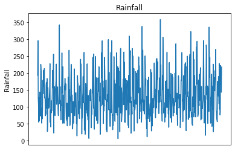
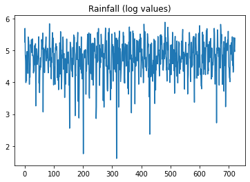
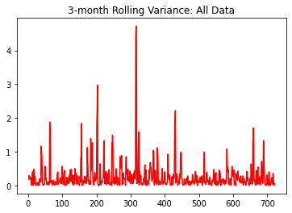
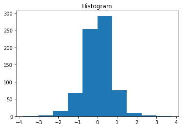
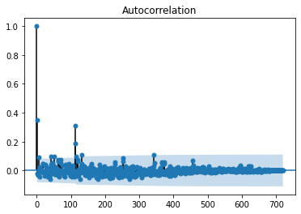
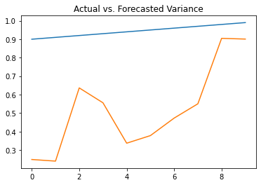

[Home](https://mgcodesandstats.github.io/) |
[GitHub](https://github.com/mgcodesandstats) |
[Speaking Engagements](https://mgcodesandstats.github.io/speaking-engagements/) |
[Terms](https://mgcodesandstats.github.io/terms/) |
[E-mail](mailto:contact@michael-grogan.com)

# Modelling Rainfall Volatility with ARCH

ARCH (Autoregressive Conditional Heteroscedasticity) is a commonly used technique for forecasting the volatility of a time series.

Standard time series models such as ARIMA can be useful in forecasting time series with a clearly defined trend, but often fail to produce meaningful results when the time series is volatile.

## Background

Yearly rainfall data can be inherently volatile. Unlike temperature, which typically demonstrates a clear trend through the seasons, rainfall as a time series can show strong and seemingly random oscillations. In Ireland, it is not uncommon for summer months to see as much rain as that of winter months.

Here is a graphical illustration of rainfall patterns from November 1959 for Newport, Ireland:



Using the Ljung-Box test, the p-value of less than 0.05 indicates that the residuals in this time series demonstrate a random pattern, indicating significant volatility:

```
>>> res = sm.tsa.ARMA(tseries, (1,1)).fit(disp=-1)
>>> sm.stats.acorr_ljungbox(res.resid, lags=[10])
(array([78.09028704]), array([1.18734005e-12]))
```

## Data Manipulation and Model Configuration

The dataset in question comprises of 722 months of rainfall data. The rainfall data for Newport, Ireland was sourced from the [Met Eireann website](https://www.met.ie/climate/available-data/historical-data).

The time series is converted into log format, in order to smooth out extreme values in the series:



When examining the 3-month rolling variance of the series, we can see that there are spikes in such variance at certain intervals:



The series is then first-differenced to approximate a normal (or Gaussian distribution).

```
>>> data=np.diff(data,1)
>>> data

array([ 4.25640181e-01, -8.37081662e-01, -1.86866663e-01, -6.77251568e-01,
        8.55480564e-01, -7.94310418e-01,  7.53258376e-01,  1.62683255e-01,
...
9.70220263e-01, -2.88433444e-01, -8.99128654e-02, -6.45385211e-02, 4.21936888e-01])
```        



A plot of the histogram for the first-differenced series indicates a normal distribution. 

The reason this is important is that the volatility of the series needs to be isolated from trend or seasonal components - the ARCH model operates on the assumption that the series is stationary in other regards, even if the variance of the series is not constant.

The series is squared, and an ACF plot is generated to examine autocorrelation trends:



A spike in autocorrelation is observed at roughly *t=100*, after which point autocorrelation settles out. In this regard, **p** (or the number of lag variances) in the ARCH model is set at 100.

## ARCH Modelling

The last 10 months of volatility for the dataset is forecasted.

```
n_test = 10
train, test = data[:-n_test], data[-n_test:]
model = arch_model(train, mean='Zero', vol='ARCH', p=100) # where p = number of lag variances
```

The model is defined as follows:

```
Zero Mean(constant: no, no. of exog: 0, volatility: ARCH(p: 100), distribution: Normal distribution, ID: 0x7ff36a0ab3c8)
```

Forecasts are conducted using the model:

```
>>> model_fit = model.fit()
>>> yhat = model_fit.forecast(horizon=n_test)

Iteration:      1,   Func. Count:    103,   Neg. LLF: 772.2689908279483
Iteration:      2,   Func. Count:    209,   Neg. LLF: 770.6703729413227
...
Iteration:     51,   Func. Count: 5.3e+03,   Neg. LLF: 717.9537369652888
Iteration:     52,   Func. Count: 5.41e+03,   Neg. LLF: 717.953734727474
Optimization terminated successfully.    (Exit mode 0)
            Current function value: 717.9537329817208
            Iterations: 53
            Function evaluations: 5414
            Gradient evaluations: 52
```            

The actual variance (in blue) is plotted against the predicted variance (in orange).



## Conclusion

Many thanks for your time, and the associated repository for this example can be found [here](https://github.com/MGCodesandStats/lstm-rainfall).

## References

[- Machine Learning Mastery: How to Model Volatility with ARCH and GARCH for Time Series Forecasting in Python](https://machinelearningmastery.com/develop-arch-and-garch-models-for-time-series-forecasting-in-python/)

[- Met Eireann: Irish Weather Data](https://www.met.ie/climate/available-data/historical-data)